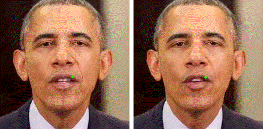

# Analyzing and Improving Motion Stability for Talking Face Generation

Figure 1: Synthesizing talking face videos with/without motion jitters. Left: Baseline model. Right: Ours. Following the trajectory of the key lip landmark (green marker), more irregular jitters can be observed in the left video than the right. Please zoom in for more details.
